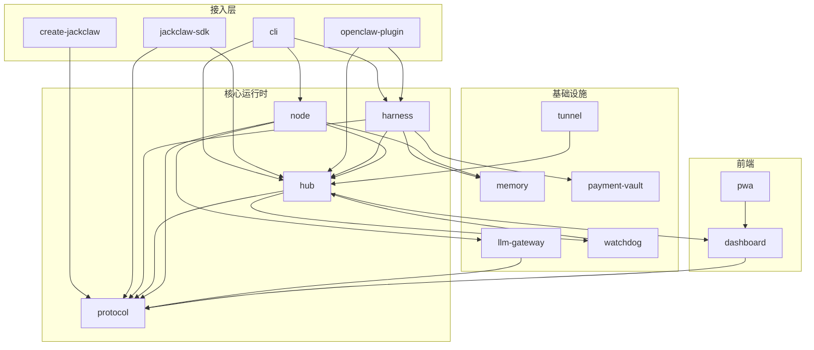

# 架构总览

## Hub / Node / CEO 三角架构

JackClaw 的核心是一个三角协作模型：

```
         ┌─────────────┐
         │     CEO     │  ← 战略决策 & Human-in-Loop
         └──────┬──────┘
                │ 任务指令
         ┌──────▼──────┐
         │     Hub     │  ← 任务广播 & 状态聚合
         └──┬───┬───┬──┘
            │   │   │
       ┌────▼┐ ┌▼───┐ ┌▼────┐
       │Node │ │Node│ │Node │  ← 并行执行 & 工具调用
       └─────┘ └────┘ └─────┘
```

| 角色 | 职责 | 对应包 |
|------|------|--------|
| **CEO** | 接收用户目标，拆解任务，做关键决策 | `harness` |
| **Hub** | 任务注册、广播、状态管理、日志聚合 | `hub` |
| **Node** | 认领任务、调用 LLM/工具、返回结果 | `node` |

### 关键设计原则

- **Hub 无状态广播**：Hub 不保留任务逻辑，只做路由和聚合
- **Node 水平扩展**：任意数量的 Node 可动态加入/退出集群
- **CEO 人类授权**：高风险操作自动触发 Human-in-Loop 等待确认

---

## 15 个包的职责

### 核心运行时

| 包 | 说明 |
|----|------|
| `protocol` | 消息格式、TaskBundle、事件类型定义（TypeScript 类型源）|
| `hub` | HTTP + WebSocket 服务器，任务注册/广播/状态机 |
| `node` | Node 运行时，任务认领、LLM 调用、结果上报 |
| `harness` | CEO 层，任务拆解、Human-in-Loop 控制流 |

### 接入层

| 包 | 说明 |
|----|------|
| `cli` | `jackclaw` 命令行工具（demo / start / status）|
| `create-jackclaw` | 项目脚手架（`npm create jackclaw`）|
| `jackclaw-sdk` | Node.js SDK，供外部系统接入 Hub |
| `openclaw-plugin` | Claude Code 插件，零配置集成 |

### 基础设施

| 包 | 说明 |
|----|------|
| `llm-gateway` | LLM 代理层，支持多 provider、重试、限流 |
| `memory` | 持久化记忆（向量检索 + 键值存储）|
| `payment-vault` | 支付凭证隔离存储，防止 AI 直接访问 |
| `watchdog` | 健康检查、自动重启、告警推送 |
| `tunnel` | 内网穿透，将本地 Hub 暴露到公网 |

### 前端

| 包 | 说明 |
|----|------|
| `dashboard` | 任务看板 Web UI（React + WebSocket 实时更新）|
| `pwa` | PWA 移动端壳，支持离线任务推送通知 |

---

## 数据流

### 任务生命周期

```
用户输入
  │
  ▼
CEO (harness)
  ├─ 拆解为 TaskBundle[]
  ├─ 高风险任务 → Human-in-Loop 等待确认
  │
  ▼
Hub
  ├─ POST /task/register   → 任务入队
  ├─ WS broadcast          → 广播给所有 Node
  ├─ GET /task/claim       → Node 认领
  │
  ▼
Node
  ├─ 调用 llm-gateway      → LLM 推理
  ├─ 调用工具（文件/搜索/API）
  ├─ POST /task/complete   → 上报结果
  │
  ▼
Hub 聚合结果
  ├─ WebSocket push        → Dashboard 实时更新
  └─ 回调 CEO              → 下一步决策
```

### 消息格式（TaskBundle）

所有任务通过 `@jackclaw/protocol` 定义的 `TaskBundle` 格式传输，确保 Hub、Node、SDK 三方一致。详见 [协议规范](/api/protocol)。

---

## 15 包依赖关系图



> **图示说明**：箭头方向表示"依赖于"。`protocol` 是零依赖的类型中心，所有包均可安全引用。

---

## 消息完整路径

### 从用户输入到任务完成的全链路

```
┌──────────────────────────────────────────────────────┐
│  1. 用户输入（自然语言目标）                          │
│     CLI / OpenClaw Plugin / SDK                       │
└──────────────────────┬───────────────────────────────┘
                       │
                       ▼
┌──────────────────────────────────────────────────────┐
│  2. CEO 层（harness）                                 │
│   • 解析目标 → 调用 LLM 拆解为 TaskBundle[]          │
│   • 检测高风险操作 → 触发 Human-in-Loop              │
│   • 等待用户确认（approve / reject / modify）        │
│   • 提交到 Hub：POST /api/task/submit                │
└──────────────────────┬───────────────────────────────┘
                       │ HTTP / WebSocket
                       ▼
┌──────────────────────────────────────────────────────┐
│  3. Hub（中枢调度）                                   │
│   • 任务入队 → 分配 task_id                          │
│   • WS broadcast → 推送给所有在线 Node               │
│   • 等待 Node 认领：GET /api/task/claim              │
│   • 维护任务状态机：pending → claimed → done/failed  │
└──────────────────────┬───────────────────────────────┘
                       │ WebSocket
                       ▼
┌──────────────────────────────────────────────────────┐
│  4. Node（执行单元）                                  │
│   • 收到广播 → 检查能力匹配 → 发起 claim             │
│   • 调用 llm-gateway → LLM 推理（支持流式输出）      │
│   • 调用工具：文件系统 / 搜索 / 外部 API             │
│   • 上报进度：WS event task.progress                 │
│   • 上报结果：POST /api/task/complete                │
└──────────────────────┬───────────────────────────────┘
                       │
                       ▼
┌──────────────────────────────────────────────────────┐
│  5. 结果聚合与回调                                    │
│   • Hub 更新任务状态 → WS push 到 Dashboard          │
│   • 回调 CEO → 判断是否需要下一轮任务拆解            │
│   • 所有 TaskBundle 完成 → 生成最终摘要返回用户      │
└──────────────────────────────────────────────────────┘
```

### WebSocket 事件类型（完整列表）

| 事件名 | 方向 | 说明 |
|--------|------|------|
| `task.broadcast` | Hub → Node | 新任务广播 |
| `task.claimed` | Node → Hub | Node 认领确认 |
| `task.progress` | Node → Hub | 执行进度（百分比 + 中间日志）|
| `task.complete` | Node → Hub | 任务完成 + 结果 payload |
| `task.failed` | Node → Hub | 任务失败 + 错误详情 |
| `node.heartbeat` | Node → Hub | 心跳保活（默认 10s 间隔）|
| `node.registered` | Hub → Node | 注册成功确认 + 分配 node_id |
| `dashboard.update` | Hub → Dashboard | 状态聚合推送（任务列表快照）|
| `hitl.request` | Hub → CEO | Human-in-Loop 请求，等待确认 |
| `hitl.response` | CEO → Hub | 用户确认结果（approve/reject）|

---

## 安全模型

### 分层防御架构

```
┌─────────────────────────────────────────┐
│  Layer 4：Human-in-Loop（最终防线）      │
│  高风险操作必须人工确认后才能执行        │
├─────────────────────────────────────────┤
│  Layer 3：payment-vault 隔离            │
│  支付凭证独立进程，AI 无法直接读取       │
├─────────────────────────────────────────┤
│  Layer 2：JWT + TLS                     │
│  所有 Node ↔ Hub 通信签名 + 加密        │
├─────────────────────────────────────────┤
│  Layer 1：watchdog 监控                 │
│  异常行为自动告警 + 熔断                │
└─────────────────────────────────────────┘
```

### JWT 认证流程

Node 注册时必须携带由 `JWT_SECRET` 签发的 token：

```
Node                           Hub
 │                              │
 │  POST /api/node/register     │
 │  Authorization: Bearer <JWT> │
 │─────────────────────────────>│
 │                              │ 验证签名 + expiry
 │  { node_id, ws_url }         │
 │<─────────────────────────────│
 │                              │
 │  WS connect (node_id)        │
 │─────────────────────────────>│
 │  任务广播开始...              │
```

Token 有效期默认 24 小时，可通过 `JWT_TTL` 环境变量调整。

### Human-in-Loop 触发条件

以下操作会自动暂停执行，等待用户确认：

| 风险类别 | 示例 |
|---------|------|
| 文件系统破坏性操作 | `rm -rf`、覆盖核心配置文件 |
| 外部资金操作 | 支付、转账、发票生成 |
| 公开发布 | 推送代码、发布 npm、发送邮件 |
| 权限提升 | `sudo`、修改 SSH key |
| 批量数据变更 | 数据库 `DELETE`、批量 API 写入 |

详见 [安全指南](/guide/security)。
